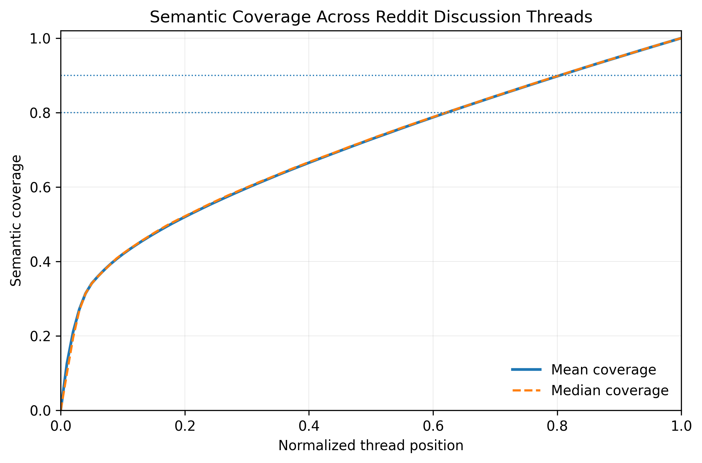
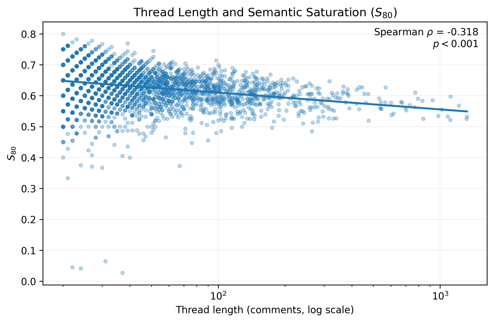

# Semantic Saturation in Online Discussion Threads

This repository accompanies *Semantic Saturation in Online Discussion Threads*. It measures how quickly the prefix of a Reddit discussion semantically represents its completed discussion. Semantic saturation is operationalized with sentence embeddings: as comments arrive, the analysis asks how well the comments seen so far cover the semantic content of all comments in that thread.

## Research question

How quickly do online discussion threads reach semantic saturation, and do longer threads saturate earlier proportionally?

## Dataset

The analysis uses the Cornell ConvoKit Reddit Corpus (small). The corpus is not redistributed here; it remains subject to its own terms. Obtain it through ConvoKit:

```powershell
py -c "from convokit import download; print(download('reddit-corpus-small'))"
```

The completed study retained 263,781 usable comments after cleaning. Root Reddit posts were excluded; only empty comments and the literal `[deleted]` and `[removed]` comments were removed. Threads required at least 20 usable comments, yielding 3,283 eligible threads and 202,024 eligible comments.

## Method

Each comment is represented with `sentence-transformers/all-mpnet-base-v2`. For a thread with embeddings `e_1, ..., e_n`, semantic coverage after observing the first `k` comments is:

```text
C(k) = (1 / n) sum_j max_{i <= k} cos(e_i, e_j)
```

`S80` and `S90` are the fractions of the thread required for coverage to reach 0.80 and 0.90, respectively. Semantic coverage is embedding-based; it is not factual completeness or human-coded idea coverage.

## Results

| Result | Value |
|---|---:|
| Eligible threads | 3,283 |
| Eligible comments | 202,024 |
| Median S80 | 0.634 |
| Median S90 | 0.816 |
| Spearman rho (thread length vs. S80) | -0.318 |
| p-value | < 0.001 |

The typical thread reached 80% semantic coverage after about 63% of its comments and 90% coverage after about 82%. Longer threads tended to reach the 80% threshold earlier proportionally.

## Figures



*Figure 1. Aggregate semantic coverage across normalized thread position.*



*Figure 2. Thread length and proportional saturation at 80% semantic coverage.*

PDF versions are available in [figures/fig1_semantic_coverage_curve.pdf](figures/fig1_semantic_coverage_curve.pdf) and [figures/fig2_thread_length_vs_s80.pdf](figures/fig2_thread_length_vs_s80.pdf).

## Reproduction

Install dependencies:

```powershell
py -m pip install -r requirements.txt
```

Run the analysis with the path printed by ConvoKit:

```powershell
py .\analyze_semantic_saturation.py --corpus "PATH_PRINTED_BY_CONVOKIT" --output results
```

The same command resumes automatically after interruption. Embeddings are stored in chunked checkpoints under `results/checkpoints/`; completed chunks and completed thread results are detected on restart. The pipeline uses CUDA automatically when available, otherwise CPU. To select explicitly, add `--device cuda` or `--device cpu`.

See [RUN.md](RUN.md) for checkpoint details, memory-oriented options, and intentional recomputation.

## Outputs

- [results/summary.json](results/summary.json): frozen paper-level summary statistics and the Spearman result.
- [results/thread_metrics.csv](results/thread_metrics.csv): one row per eligible thread with comment count, S80, and S90.
- [results/thread_curves.csv](results/thread_curves.csv): normalized semantic-coverage curve for each eligible thread; generated locally, not tracked because of size.
- [results/aggregate_curve.csv](results/aggregate_curve.csv): mean, median, and contributing-thread count at each normalized position.

## Scope and limitations

This study examines one Reddit corpus with one embedding model. Embedding similarity is an operationalization of semantic overlap, not a measure of factual completeness. The analysis makes no causal claims.

## Citation and authorship

This repository accompanies *Semantic Saturation in Online Discussion Threads*. It does not claim publication or acceptance. Please cite the repository and accompanying paper where appropriate; see [CITATION.cff](CITATION.cff).

Anshima Srivastava<br>
Bhavdiya Public School, Ayodhya, India<br>
anshima0003@gmail.com

## License and data

The code is released under the [MIT License](LICENSE). The Cornell ConvoKit Reddit dataset is not relicensed by this repository and remains subject to its own terms.
